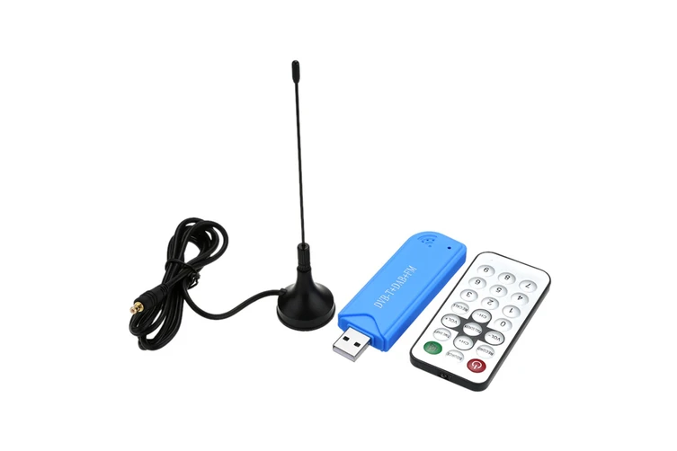

# rtl_433 to WebSockets

This python script uses the [rtl_433](https://github.com/merbanan/rtl_433) tool to receive almost any wirelessly transmitted data and forwards the messages as JSON via WebSockets - so it can be used in the browser.

## Prerequisities

- You must use Windows
- You need an SDR-Receiver (see [SDR-Receiver](#sdr-receiver))
- You must have Python 3 installed (tested with v3.11) -> [Download it here](https://www.python.org/downloads/)

## Installation

1. Copy or Clone this repo -> [Download as Zip](https://github.com/nonsensation/rtl433-2-ws/archive/refs/heads/main.zip)

2. Download and unzip the [rtl_433](https://github.com/merbanan/rtl_433/releases) tool into this folder.  
Here is a download link with the version I tested it with (x64):
[DOWNLOAD](https://github.com/merbanan/rtl_433/releases/download/23.11/rtl_433-win-x64-23.11.zip)

3. Rename the folder to `rtl_433`. It should look like this:

```
   📁 /rtl433-2-ws/
    ├──📄 rtl433-2-ws.py
    ├──📄 rtl433-2-ws.html
    ├──📄 ...
    └──📁 /rtl_433/
        ├──📄 rtl_433.exe
        └──📄 ...
```

4. Start the WebSocket-Server via Python  
   Open a Terminal (Right-Click in the File Explorer) and run `py rtl433-2-ws.py`

5. You can display the messages in the Browser, simply double-click `rtl433-2-ws.html`

## Configuration

You can modify the `config.toml` file (it s just a text file)

Available settings:

- host (string, default: `'0.0.0.0'`): defines the host server IP address
    Can be `'localhost'` or `'0.0.0.0'` for internal use
- port (positive integer, default `443`): the port
- password (string, default `''`): the password, can be left empty (all clients can connect)

## SDR-Receiver

I have tested it with a cheap 10€ USB Stick



You might have to install the Stick with this utility tool: https://zadig.akeo.ie/

## Technical Details

See Documentation:
- https://github.com/merbanan/rtl_433/blob/master/docs/OPERATION.md
- https://github.com/merbanan/rtl_433/blob/master/docs/DATA_FORMAT.md


## TODO

- If needed, adapt for other OS
